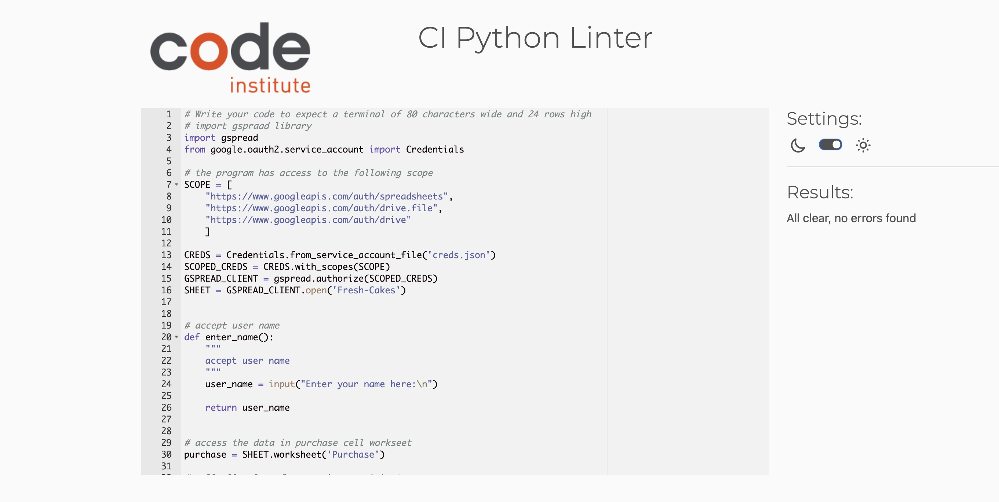

# Fresh Cakes
(Developer: Selam Yigezu)
 The Fresh-cakes app is a simple app developed for a cake shop which accept the name of the person who manage the shop and accept the sold values and  calculate the amount of cakes which needs to be baked for the next market.
 

# User Experience (UX)

## Business Goals

### User Goals
- To save the data of the sold cakes
- easy to use
- Possibility to restart the app
- update the googel worksheet of the data

### Website Owner Goals
- Deliver easy-to-use stock managment system 
- calculate the amount of data needed for the next market and minimize waste
- To save stock values on googel spread sheet

### Target Audience
- for all cafe owners 

### User Expectations
- Smooth and easy to use app
- Appealing design
- Accessibility

### Features Left to Implement

- solving the error related with urllib3
## Validator Testing 

- This project has been tested with (https://pep8ci.herokuapp.com/) and no error is detected
 

- All possible user input points have been tested to ensure error on my vs code terminal

### Unfixed Bugs
-the following error appears NotOpenSSLWarning: urllib3 v2.0 only supports OpenSSL 1.1.1+, currently the 'ssl' module is compiled with 'LibreSSL 2.8.3'. See: https://github.com/urllib3/urllib3/issues/3020 

